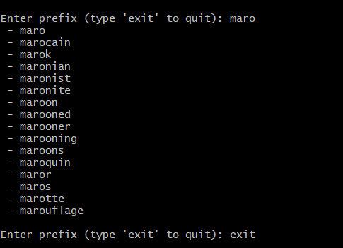
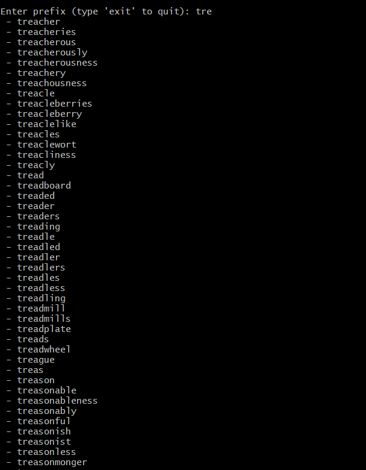
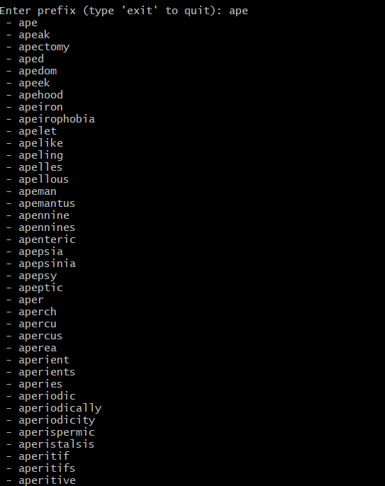

# C++ Autocomplete Engine 

A high-performance, command-line autocomplete engine built from scratch in C++. This project utilizes a custom **AVL Tree** data structure to ensure fast, balanced insertions and strictly $O(\log n)$ search times for prefix matching, even with large dictionary files.

## Features
* **Custom AVL Tree:** Self-balancing binary search tree preventing worst-case $O(n)$ degradation.
* **Fast Prefix Search:** Efficiently traverses the tree to find and return all words matching a given prefix.
* **Automated Build System:** Configured with CMake for easy cross-platform compilation.
* **Extensive Testing:** Tested against the dictionary containing 370105 records.

## Result of Testing




## Challanges and solutions
Building a self-balancing tree and a cross-platform build system from scratch came with several significant hurdles.
Here is a breakdown of the problems faced and how they were resolved.

1. The MinGW & CMake Integration Clash
The Challenge: When running cmake .. on Windows via Git Bash, CMake threw errors regarding 
missing compilers (CMAKE_C_COMPILER not set) and attempted to use Visual Studio's nmake, which failed.

The Solution: Windows environments using MinGW require explicit generator instructions.
I solved this by cleaning the CMakeCache.txt (which holds onto failed configurations)
and forcing CMake to use MinGW tools while bypassing the Git Bash shell environment wrapper
using: cmake -G "MinGW Makefiles" -DCMAKE_SH="CMAKE_SH-NOTFOUND" ...

2. CMake "Missing Source" Errors for Header-Only Structures
The Challenge: The build failed with Cannot find source file: src/Node.cpp.

The Solution: The Node struct was implemented as a "Header-Only" file (Node.hpp)
because its logic (just a constructor initializing pointers and height) was
incredibly lightweight. I had to update CMakeLists.txt to remove Node.cpp from the SOURCES
variable, aligning the build system with the actual project architecture.

3. The std::bad_alloc Enigma (Infinite Recursion)
The Challenge: When loading the dictionary (even with just 6 words), the program immediately
crashed with a std::bad_alloc memory error. This indicated the heap/stack was overflowing
due to an infinite loop.

The Solution: The issue was traced to the AVL Tree's rotation logic. A subtle bug in variable assignment
during rotateLeft and rotateRight was causing a circular reference (Node A pointing to Node B,
and Node B pointing back to Node A). When updateHeight or getBalance ran on these broken subtrees,
it triggered infinite recursion. Fixing the Pivot and Inner Child pointer assignments
and ensuring Node->height was strictly initialized to 1 in the constructor completely resolved the memory leak.

4. Search Traversal Overheads and Out-of-Bounds Exceptions
The Challenge: Searching for prefixes using word.substr(0, length) was dangerous if a node's
word was shorter than the search prefix. Furthermore, calling substr inside a recursive function
created thousands of temporary strings, bogging down memory.

The Solution: First, I added a length safety check (root->word.length() >= length). Later,
to optimize the tree traversal, I refactored the search handler to use root->word.compare(0, length, prefix).
This allowed the engine to check prefixes without generating temporary substring copies,
drastically improving stability and speed on large dictionaries.


## Project Structure
```text
AutocompleteProject/
├── build/                # Compiled binaries and CMake cache (generated)
├── data/                 # Contains the dictionary (e.g., words.txt)
├── include/              # Header files (.hpp)
│   ├── AutoComplete.hpp
│   ├── AVLTree.hpp
│   └── Node.hpp
├── src/                  # Source files (.cpp)
│   ├── AutoComplete.cpp
│   ├── AVLTree.cpp
│   └── main.cpp
├── CMakeLists.txt        # Build configuration
└── README.md             # Project documentation


Project Structure
|   -mkdir build
|   -cd build
|   -# For Windows (MinGW/Git Bash):
|   -cmake -G "MinGW Makefiles" -DCMAKE_SH="CMAKE_SH-NOTFOUND" ..
|   -# For Linux/macOS:
|   -cmake ..
|   -cmake --build .

Run the Execcutable file
# Windows
./AutocompleteApp.exe
# Linux/macOS
./AutocompleteApp
